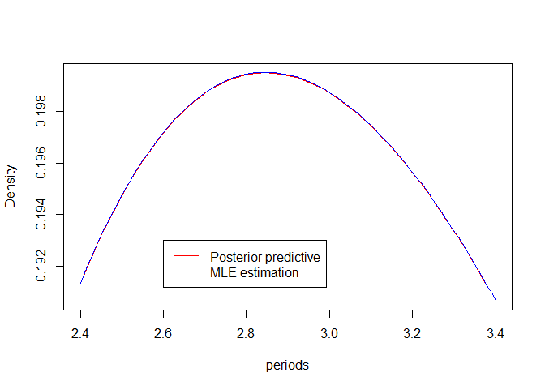

Statistical analysis of exoplanet orbital period
================
Davide Facchinelli

``` r
library(readr)
library(runjags)
library(e1071)
```

# Introduction

We are going to study exoplanet data; we are particularly interested to
their orbital period. That is the duration of a year on one of this
planet: the time they need to do a revolution around their star. We are
going to study its distribution.

We are going to consider a set of I.I.D.
 representing each an exoplanet orbital period from a
dataset of exoplanet observed via the Kepler telescope, and we are going
to study their distribution.

# Data

We import our dataset from
<https://exoplanetarchive.ipac.caltech.edu/docs/API_kepcandidate_columns.html>

``` r
site = "https://exoplanetarchive.ipac.caltech.edu/cgi-bin/nstedAPI/nph-nstedAPI"
options = "?table=cumulative&select=koi_duration&format=ascii"

cumulative <- read_table2(paste(site, options, sep = ""), 
    col_names = FALSE, skip = 12)

periods = cumulative$X1
```

Let’s give a look to our
data.

``` r
hist(periods, breaks = 100, xlim = c(0, 30))
```

<!-- -->

The distribution is clearly right-skewed, as confirmed by a rapid
calculation.

``` r
skewness(periods)
```

    ## [1] 5.926905

We propose two model classically used for right-skewed data with our
shape: the log-normal distribution
") and the gamma distribution
"). We will check which better fits our data.

# Analysis

We will conduct both a frequentist and a bayesian analysis and compare
our results at the end.

## Baysian analysis

We will build and use two models in JAGS to compute the distributions
for our data. we will do that both for the gamma distribution and the
log-normal distribution and after decide which model better fits via a
model comparison exploiting the bayes factor. (a good reference for this
part will be Ntzoufras 2009)

### Model

First of all we need to set our bayesian word for our four parameters.
We will use

  - ")
  - ")
  - ")
  - ")

with non-informative hyperparameters.

Let us build our models in JAGS.

``` r
modellnorm = "
  model {
    for (i in 1:n) {
      periods[i]~dlnorm(mu,temp)
    }
    mu~dnorm(0,0.01)
    sigma~dgamma(0.01,0.01)
    temp = 1/sigma
  
  #monitor# mu, sigma

  }
"
modelgamma = "
  model {
    for (i in 1:n) {
      periods[i]~dgamma(k,theta)
    }
    k~dgamma(0.01,0.01)
    theta~dgamma(0.01,0.01)
  
  #monitor# k, theta

  }
"
```

We run our models.

``` r
data.to.jags = list(periods = periods, n = length(periods))

modellnorm = run.jags(model = modellnorm, data = data.to.jags, 
    n.chains = 2, sample = 2000)
```

    ## Loading required namespace: rjags

    ## Compiling rjags model...
    ## Calling the simulation using the rjags method...
    ## Adapting the model for 1000 iterations...
    ## Burning in the model for 4000 iterations...
    ## Running the model for 2000 iterations...
    ## Simulation complete
    ## Calculating summary statistics...
    ## Calculating the Gelman-Rubin statistic for 2 variables....
    ## Finished running the simulation

``` r
modelgamma = run.jags(model = modelgamma, data = data.to.jags, 
    n.chains = 2, sample = 2000)
```

    ## Compiling rjags model...
    ## Calling the simulation using the rjags method...
    ## Adapting the model for 1000 iterations...
    ## Burning in the model for 4000 iterations...
    ## Running the model for 2000 iterations...
    ## Simulation complete
    ## Calculating summary statistics...
    ## Calculating the Gelman-Rubin statistic for 2 variables....
    ## Finished running the simulation

We check the result for the log-normal assumption.

``` r
modellnorm
```

    ## 
    ## JAGS model summary statistics from 4000 samples (chains = 2; adapt+burnin = 5000):
    ##                                                                        
    ##       Lower95  Median Upper95    Mean        SD Mode      MCerr MC%ofSD
    ## mu     1.3784  1.3944  1.4097  1.3944 0.0078881   -- 0.00015171     1.9
    ## sigma  0.5738 0.59008 0.60705 0.59029 0.0085048   --  0.0001635     1.9
    ##                              
    ##       SSeff     AC.10    psrf
    ## mu     2704  -0.02207 0.99998
    ## sigma  2706 -0.018793  1.0005
    ## 
    ## Total time taken: 2.5 minutes

``` r
plot(modellnorm, plot.type = c("trace"))
```

    ## Generating plots...

<!-- -->

``` r
plot(modellnorm, plot.type = c("ecdf"))
```

    ## Generating plots...

<!-- -->

``` r
plot(modellnorm, plot.type = c("autocor"))
```

    ## Generating plots...

<!-- -->

And for the gamma assumption.

``` r
modelgamma
```

    ## 
    ## JAGS model summary statistics from 4000 samples (chains = 2; adapt+burnin = 5000):
    ##                                                                       
    ##       Lower95 Median Upper95    Mean        SD Mode      MCerr MC%ofSD
    ## k      1.6085 1.6532   1.696   1.653  0.022538   --  0.0010639     4.7
    ## theta  0.2847 0.2941 0.30245 0.29406 0.0046526   -- 0.00021634     4.6
    ##                          
    ##       SSeff  AC.10   psrf
    ## k       449 0.1485 1.0071
    ## theta   462 0.1274 1.0077
    ## 
    ## Total time taken: 5.5 minutes

``` r
plot(modelgamma, plot.type = c("trace"))
```

    ## Generating plots...

<!-- -->

``` r
plot(modelgamma, plot.type = c("ecdf"))
```

    ## Generating plots...

<!-- -->

``` r
plot(modelgamma, plot.type = c("autocor"))
```

    ## Generating plots...

<!-- -->

We can see from the trace plots that we reached convergence in both
cases. In fact for all our variables the two chain oscillate around a
specific value, meaning that they stabilized themselves on their stable
distribution. Additionally we can see that the autocorrelation go to
zero.

Now we can build our posterior predictive distribution from the data.
Let  be the
set of parameters,
 the parameter identifing the model where
 stand for the
log-normal distribution and  for the gamma distribution. We also take
") the distribution correspondent to one of the two
model . If
 are I.I.D. from the posteriori distribution
") then our posteriori predictive
distribution   
 = \\int p(x_{new}|m,\\nu)\\pi(\\nu|x_1,\\dots,x_n,m)d\\nu = ")  
  
![= \\mathbb{E}\_{\\pi(\\cdot|x\_1,\\dots,x\_n,m)}\[p(x\_{new}|m,\\nu)\]
= \\lim\_{l\\to\\infty}\\frac{1}{l}\\sum\_{i=1}^l
p(x\_{new}|m,\\nu\_i)](https://latex.codecogs.com/png.latex?%3D%20%5Cmathbb%7BE%7D_%7B%5Cpi%28%5Ccdot%7Cx_1%2C%5Cdots%2Cx_n%2Cm%29%7D%5Bp%28x_%7Bnew%7D%7Cm%2C%5Cnu%29%5D%20%3D%20%5Clim_%7Bl%5Cto%5Cinfty%7D%5Cfrac%7B1%7D%7Bl%7D%5Csum_%7Bi%3D1%7D%5El%20p%28x_%7Bnew%7D%7Cm%2C%5Cnu_i%29
"= \\mathbb{E}_{\\pi(\\cdot|x_1,\\dots,x_n,m)}[p(x_{new}|m,\\nu)] = \\lim_{l\\to\\infty}\\frac{1}{l}\\sum_{i=1}^l p(x_{new}|m,\\nu_i)")  

We already have the
 as
they are produced in the MCMC, therefore truncating the series we get an
approximation of our posterior predictive distribution.

``` r
ppd.gamma = function(x) {
    chain_k = c(modelgamma$mcmc[[1]][, 1], modelgamma$mcmc[[2]][, 
        1])
    chain_theta = c(modelgamma$mcmc[[1]][, 2], modelgamma$mcmc[[2]][, 
        2])
    return(sum(dgamma(x, chain_k, chain_theta))/length(chain_k))
}
ppd.gamma = Vectorize(ppd.gamma)

ppd.lnorm = function(x) {
    chain_mu = c(modellnorm$mcmc[[1]][, 1], modellnorm$mcmc[[2]][, 
        1])
    chain_sigma2 = c(modellnorm$mcmc[[1]][, 2], modellnorm$mcmc[[2]][, 
        2])
    return(sum(dlnorm(x, chain_mu, chain_sigma2))/length(chain_mu))
}
ppd.lnorm = Vectorize(ppd.lnorm)
```

### Result

#### Plots

Let us see what we got. We will plot our density function using the
posteriori mean estimator for the
parameters.

``` r
hist(periods, breaks = 100, xlim = c(0, 30), prob = T, main = "Log-normal fit")
plot(ppd.lnorm, col = "red", add = T, xlim = c(0, 30), lwd = 2)
```

<!-- -->

``` r
hist(periods, breaks = 100, xlim = c(0, 30), prob = T, main = "Gamma fit")
plot(ppd.gamma, col = "green", add = T, xlim = c(0, 30), 
    lwd = 2)
```

<!-- -->

#### Model comparison

We can already see from the plot that the log-normal is a better fit by
far, but for completeness we will include a likelihood ratio test. That
is, we are going to consider the proportion of the likelihoods   
}{\\prod_{i=1}^n m(x_i|x_1,\\dots,x_n,2)}")  
If this value is greater than one the first model, the log-normal
distribution, will be a better fit. Otherwise we should prefer the gamma
distribution.

``` r
lllnorm = ppd.lnorm(periods)
llgamma = ppd.gamma(periods)

PBF = prod(lllnorm/llgamma)
PBF
```

    ## [1] 5.383714e+117

As we can see we obtain a very high PBF, confirming the evident fact
that the log-normal is a better fit for our data.

#### Goodness of fit

Now the remaining question is: how well our log-normal distribution fit
the data?

To answer this question we will use a posteriori predictive assessment
using discrepancies method (see Andrew Gelman 1996). In practice we will
consider a discrepancy function for a generic set of normal and equally
distributed observation ") as   
 = \\sum_{i=1}^n\\frac{(y_i - \\mu)^2}{\\sigma^2}")  
Let’s remark that if  and
 are the mean and standard deviation of the distribution
from where we sample the
 then
 is distributed
as a  distribution.

As our variable is log-normal distributed we need to adapt this
discrepancy function, considering
") instead of . In our case we will use   
 = \\sum_{i=1}^n\\frac{(\\ln(y_i) - \\mu)^2}{\\sigma^2}")  

Let us write as before . In our specific case we will define the
posterior predictive p-value   
 = \\int \\mathbb P(\\chi_n^2\\geq X^2(x_1\\dots,x_n;\\nu))\\pi(\\nu|x_1\\dots,x_n)d\\nu")  
As usual in the bayesian context we do not obtain specific value for our
parameters, but their distribution
") and therefore we consider the above
integral averaging all the possible
") functions.

Our null-hypothesis will be that our data follows the posterior
predictive distribution. As it is obtained as a marginal distribution
from a log-normal set of functions the above p-value will be adapt to
verify our hypothesis.

As before we want to exploit that we already draw a sample for our
parameters
 considering that   
)\\pi(\\nu|x_1\\dots,x_n)d\\nu =")  
  
![= \\mathbb{E}\_{\\pi(\\cdot|x\_1\\dots,x\_n)}\[\\mathbb
P(\\chi\_n^2\\geq
X^2(x\_1\\dots,x\_n;\\nu))\]=\\lim\_{l\\to\\infty}\\frac{1}{l}\\sum\_{i=1}^l\\mathbb
P(\\chi\_n^2\\geq
X^2(x\_1\\dots,x\_n;\\nu\_i))](https://latex.codecogs.com/png.latex?%3D%20%5Cmathbb%7BE%7D_%7B%5Cpi%28%5Ccdot%7Cx_1%5Cdots%2Cx_n%29%7D%5B%5Cmathbb%20P%28%5Cchi_n%5E2%5Cgeq%20X%5E2%28x_1%5Cdots%2Cx_n%3B%5Cnu%29%29%5D%3D%5Clim_%7Bl%5Cto%5Cinfty%7D%5Cfrac%7B1%7D%7Bl%7D%5Csum_%7Bi%3D1%7D%5El%5Cmathbb%20P%28%5Cchi_n%5E2%5Cgeq%20X%5E2%28x_1%5Cdots%2Cx_n%3B%5Cnu_i%29%29
"= \\mathbb{E}_{\\pi(\\cdot|x_1\\dots,x_n)}[\\mathbb P(\\chi_n^2\\geq X^2(x_1\\dots,x_n;\\nu))]=\\lim_{l\\to\\infty}\\frac{1}{l}\\sum_{i=1}^l\\mathbb P(\\chi_n^2\\geq X^2(x_1\\dots,x_n;\\nu_i))")  
that we approximate via truncation.

Let us build our  function for the log-normal distribution.

``` r
X2lnorm = function(obs, mu, sigma2) {
    return(sum((log(obs) - mu)^2/sigma2))
}
```

And we compute the p-value in our case.

``` r
chain_mu = c(modellnorm$mcmc[[1]][, 1], modellnorm$mcmc[[2]][, 
    1])
chain_sigma2 = c(modellnorm$mcmc[[1]][, 2], modellnorm$mcmc[[2]][, 
    2])

p_B = 0

for (i in 1:length(chain_mu)) {
    p_B = p_B + pchisq(X2lnorm(periods, chain_mu[i], chain_sigma2[i]), 
        df = length(periods), lower.tail = FALSE)
}

p_B = p_B/length(chain_mu)

p_B
```

    ## [1] 0.4980826

We can see that the p-value is over any reasonable threshold, therefore
we can conclude that our posterior predictive distribution fit well the
data.

## Frequentist analysis

We already took a log-normal distribution for our data, a well-known
distribution. Let us see what we get estimating it via a maximum
likelihood estimator.

### MLE

The estimator for the maximum likelihood of a log-normal distribution
are well known:   
  
  
^2}{n}")  

``` r
mu_MLE = sum(log(periods))/length(periods)

sigma2_MLE = sum((log(periods) - mu_MLE)^2)/length(periods)
```

### Results

Let us plot the estimated function.

``` r
hist(periods, breaks = 100, xlim = c(0, 30), prob = T)
plot(function(x) dlnorm(x, mu_MLE, sigma2_MLE), col = "blue", 
    add = T, xlim = c(0, 30), lwd = 2)
```

<!-- -->

As we can see we obtain a quite good fit.

Now we check how good this fit is: we will use a readapted posterior
predictive assessment test. It is not the best possible test for an MLE
estimator, but as later we will compare the frequentist and bayesian
result using the same test gave us some advantages.

We now have to consider that we have two fixed values for the parameters
given by the MLE, so our p-value became   
 = \\mathbb P(\\chi_n^2\\geq X^2(x_1\\dots,x_n;\\nu_{ML})")  
as we do not need anymore to average on all the possible values of the
parameters.

``` r
p_ML = pchisq(X2lnorm(periods, mu_MLE, sigma2_MLE), df = length(periods), 
    lower.tail = FALSE)
p_ML
```

    ## [1] 0.498077

Again, we see that we get quite a good fit.

## Comparison between the frequentist and bayesian

Here we analyse the two estimated distribution to decide which better
fit our data. We will compare
") with the predictive posteriori
distribution
") obtained from the MCMC based on the log-normal
priori.

First of all we can attempt to visualise the
difference.

``` r
plot(ppd.lnorm, col = "red", xlim = c(0, 30), lwd = 2, ylab = "Density", 
    xlab = "periods")
plot(function(x) dlnorm(x, mu_MLE, sigma2_MLE), col = "blue", 
    add = T, xlim = c(0, 30), lwd = 2)
legend(15, 0.193, legend = c("Posterior predictive", "MLE estimation"), 
    col = c("red", "blue"), lty = 1)
```

<!-- -->

``` r
plot(ppd.lnorm, col = "red", xlim = c(2.4, 3.4), lwd = 0.5, 
    ylab = "Density", xlab = "periods")
plot(function(x) dlnorm(x, mu_MLE, sigma2_MLE), col = "blue", 
    add = T, xlim = c(2.4, 3.4), lwd = 0.5)
legend(2.6, 0.193, legend = c("Posterior predictive", "MLE estimation"), 
    col = c("red", "blue"), lty = 1)
```

<!-- -->

Plotting the distributions as before don’t show us anything, because
they are too similar. Zooming in to a specific portion highlight that
there is indeed a difference but it’s clear that the two distribution
are quite similar.

Let’s use some more quantitative instrument to compare them: we will
again use the 
function defined above. We already computed the p-value of our two
models for this
    test:

``` r
c(p.value.for.posterior.predictive = p_B, p.value.for.MLE = p_ML)
```

    ## p.value.for.posterior.predictive                  p.value.for.MLE 
    ##                        0.4980826                        0.4980770

As we can see, the p-values of our two methods are very similar,
confirming what we saw drawing them: the two estimator are almos the
same.

# Conclusions

In conclusion we can say that the log-normal distribution is a good fit
for our data, in particular when obtained in a bayesian framework. We
therefore have a good proposal to explain how the orbital period of
planets are distributed.

# Bibliography

<div id="refs" class="references">

<div id="ref-gelman">

Andrew Gelman, Hal Stern, Xiao-Li Meng. 1996. “Posterior Predictive
Assessment of Model Fitness via Realized Discrepancies.” *Statistica
Sinica*, 733–807.

</div>

<div id="ref-ntzou">

Ntzoufras, Ioannis. 2009. *Bayesian Modeling Using Winbugs*. Wiley.

</div>

</div>
